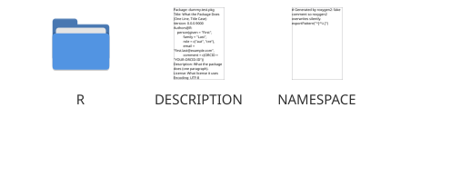
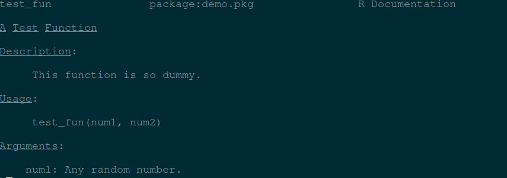
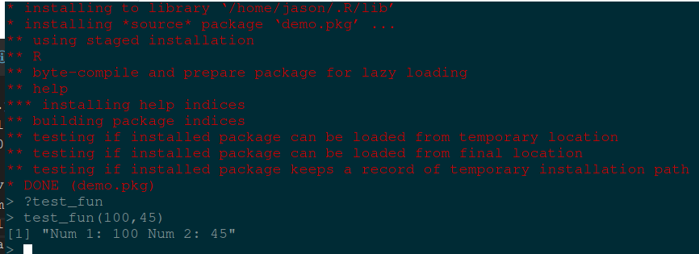

# Creating R package  

## Motivation  

As I have worked on various projects, I have accumulated a suite of functions that help me quickly produce results that I find useful. Because of the nature of iterative development, it often happens that I reuse the functions many times, mostly through the shameful method of copying the functions into the project directory.  

This tutorial is not about making a beautiful, perfect R package. This tutorial is about creating a bare-minimum R package so that you don’t have to keep copy-pasting code from project to project.  

### Step 1: Load required packages  

The packages you will need to create a package are devtools and roxygen2.  

```{R}
> install.packages("devtools")`  
> library("devtools")`  
> devtools::install_github("klutometis/roxygen")`  
> library(roxygen2)`  
```  

### Step 2: Create your package directory  

``` {R}
> setwd("/path/to/package/parent/directory")
> create('demo.pkg')
```  

If you look in your parent directory, you will now have a folder called demo.pkg, and in it you will have a folder named R and two files (DESCRIPTION and NAMESPACE)  

  

Edit the DESCRIPTION file to your `taste`  

### Step 3: Add functions  

Your functions goes to R directory. I prefer writing a function in it's own file  

``` {R}
test_fun <- function(num1,num2){  
    paste('Num 1:',num1,'Num 2:',num2)
}
```  

Save this function into R/dummy-function.R  

### Step 4: Add documentation  

Follow [roxygen2 Documentation](https://github.com/r-lib/roxygen2) for an overview of the docuemtation syntax
Modify your R/dummy-function.R file to look like this:  

```{R}
#' A Test Function
#'
#' This function is so dummy.
#' @param num1 Any random number.
#' @param num2 Any random number.
#' @keywords Num
#' @export
#' @examples
#' test_fun(28,2)
test_fun <- function(num1,num2){
    paste('Num 1:',num1,'Num 2:',num2)
}
```  

### Step 5: Generate package documentation  

Run below commands in R session  

```{R}
> setwd("./demo.pkg")
> document()
```  

### Step 6: Install (and use your function)!  

Sounds hillarous?

``` {R}
> setwd("../")
> install("demo.pkg")
> q()  #Exit R session
```  

Run a new R session, import your package and use your function!  

```{bash}  
$ R  
> library(demo.pkg)  
> ?test_fun     # View package documentation
> test_fun(100,45)  # Run the function
```  

  

  

# Congratulations!