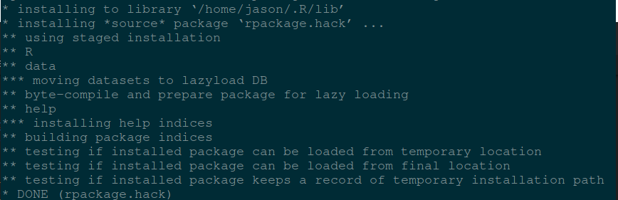

# Creating R package  

## Motivation  

As I have worked on various projects, I have accumulated a suite of functions that help me quickly produce results that I find useful. Because of the nature of iterative development, it often happens that I reuse the functions many times, mostly through the shameful method of copying the functions into the project directory.  

This tutorial is not about making a beautiful, perfect R package. This tutorial is about creating a bare-minimum R package so that you don’t have to keep copy-pasting code from project to project.  

### Step 1: Load required packages  

The packages you will need to create a package are devtools and roxygen2.  

```{R}
> install.packages("devtools")`  
> library("devtools")`  
> devtools::install_github("klutometis/roxygen")`  
> library(roxygen2)`  
```  

### Step 2: Create your package directory  

``` {R}
> setwd("/path/to/package/parent/directory")
> create('rpackage.hack')
```  

If you look in your parent directory, you will now have a folder called rpackage.hack, and in it you will have a folder named R and two files (DESCRIPTION and NAMESPACE)  

  

Edit the DESCRIPTION file to your `taste`  

### Step 3: Add functions  

Your functions goes to R directory. I prefer writing a function in it's own file  

``` {R}
test_fun <- function(num1,num2){  
    paste('Num 1:',num1,'Num 2:',num2)
}
```  

Save this function into R/dummy-function.R  

### Step 4: Add documentation  

Follow [roxygen2 Documentation](https://github.com/r-lib/roxygen2) for an overview of the docuemtation syntax  
Modify your R/dummy-function.R file to look like this:  

```{R}
#' A Test Function
#'
#' This function is so dummy.
#' @param num1 Any random number.
#' @param num2 Any random number.
#' @keywords Num
#' @export
#' @examples  
#' #Not Run  
#' test_fun(28,2)
test_fun <- function(num1,num2){
    paste('Num 1:',num1,'Num 2:',num2)
}
```  

### Step 5: Generate package documentation  

Run below commands in R session  

```{R}
> setwd("./rpackage.hack")
> document()
```  

### Step 6: Install (and use your function)!  

Sounds hillarous?

``` {R}
> setwd("../")
> install("rpackage.hack")
> q()  #Exit R session
```  

Run a new R session, import your package and use your function!  

```{bash}  
$ R  
> library(rpackage.hack)  
> ?test_fun     # View package documentation
> test_fun(100,45)  # Run the function
```  

  

  

### step 7: Making the package interesting!!!  

The above package is so basic. In this section, we are going to utilize imense power of external dependency packages and raw dataset.  

#### Add external package dependencies  

> Never use library() or require() in a R package!  

To indicate that your R package depends on these external packages, add the information to **DESCRIPTION** file under the **Imports** content. That is:-

```{md}
Imports:
    rio,
    ggplot2
```

#### Making raw data available  

The best way to ship the package with raw data is to put the raw data in folder inst/extdata. When the package gets installed, the data becomes available through the system.file() function. For instance if we have the file inst/extdata/weather_2014.csv, once the package is installed we can access this file by doing:  

`> system.file("extdata", "weather_2014.csv", package = "rpackage.hack")`  

#### {show me the `CODE` }

Create a new function, R/hobbyist.R

```{R}
#' Making it fun  
#' 
#' Lah-de-dah! Say no More!!!  
#' Here we create a function that makes use of rio::import to read a csv datafile 
#' and ggplot2 to render graphics of dataset loaded.   
#' @export 
#' @examples  
#' #Not Run  
#' hobbyist_fun()  
#' ?hobbyist_fun  

hobbyist_fun <- function(){
    # access dataset file
    data_file <- system.file("extdata", "weather_2014.csv", package = "rpackage.hack")
    # read csv dataset
    data <- rio::import(data_file)
    # render graphics
    ggplot2::ggplot(data, ggplot2::aes(season,rain)) +
        ggplot2::geom_jitter(ggplot2::aes(colour=rain), position = ggplot2::position_jitter(width = 0.2)) +
        ggplot2::scale_colour_gradient2(low = "blue", mid = "red",high = "black", midpoint = 30) +
        ggplot2::scale_y_continuous(breaks = seq(0,80,20)) +
        ggplot2::xlab("Season") +
        ggplot2::ylab ("Rain (mm)") +
        ggplot2::ggtitle("Daily rain amount by season")
}
```


#### Update package documentation  

```{R}
$ R  
> library(devtools)
> setwd('/path/to/package/parent/directory/rpackage.hack/')  
> document()  
```  

#### Build the package:  R CMD build ...  

You now have the raw materials for a simple R package. Next you need to build it. This will create a file like rpackage.hack_0.1.0.tar.gz that you can then install  or share  

Go to the directory that contains your package directory.  

```{R}
$ cd /path/to/package/parent/directory  
$ R CMD build rpackage.hack  
```

  

#### Install the package: R CMD INSTALL ...  

`$ R CMD INSTALL rpackage.hack_0.1.0.tar.gz`  

  

#### Test the package  

```{R}
$ R  
> ?rpackage.hack::hobbyist_fun 
```

  

`> rpackage.hack::hobbyist_fun()`


**Whoop-de-doo!** Congratulations!  